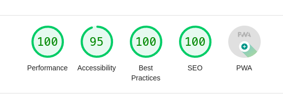

# Blog & Portfolio

This is a blog and portfolio website built with [Astro](https://astro.build/) and [Tailwind CSS](https://tailwindcss.com/).

## Demo

## Blazing Fast 

This website is built with Astro, which is a modern static site generator. It's blazing fast and has a lot of features that make it easy to build a website.

## Features

-   Blog
-   Portfolio
-   Theme Switcher
-   SEO
-   RSS Feed
-   Sitemap
-   PWAs

## Disclaimer

This website is not affiliated with Astro or Tailwind CSS. This is just a personal project. 
It is not meant to be used as a template for your own website but you can use it as a reference if you want to build your own website with Astro and Tailwind CSS.

## Contributing

If you want to contribute to this project, you can fork it and make a pull request. I will review it and merge it if it's good. 
I will also give you credit for your contribution. 

Don't forget to star this project if you like it. 

## License

[MIT](LICENSE)

## Credits

-   [Astro](https://astro.build/)
-   [Tailwind CSS](https://tailwindcss.com/)
-   [Vercel](https://vercel.com/)
-   [DaisyUI](https://daisyui.com/)
-  [IconsJS](https://icones.js.org/)

## Author

-   [Corentin GS](https://corentings.vercel.app/)